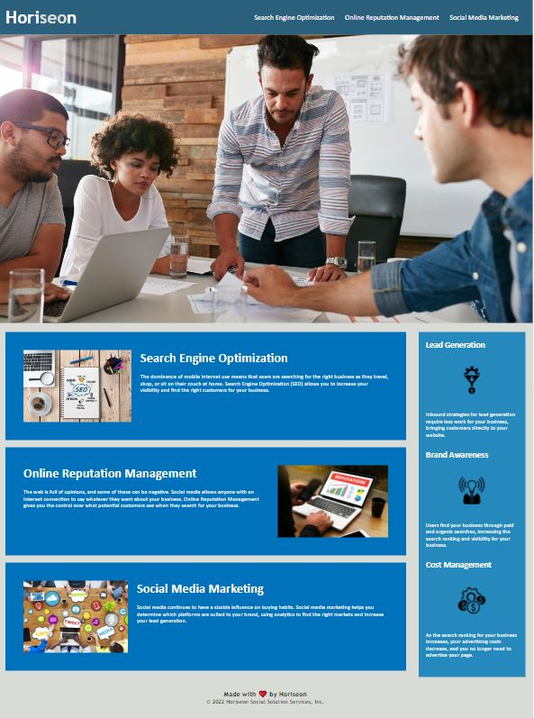

# Week 1: Code Refactor Challenge

This challenge asks to refactor the code so that if follows accessibility standards and so that the page is optimized for search engines.
This page was built with 
- HTML and 
- CSS.

## Screenshot of the page

## Changes I have made

### HTML
1. Concise title for title element
2. Replace div-elements with semantic html elements throughout
3. Structure and trim HTML elements for better readability
4. Make sure all elements are in sequential order
5. Add accessible alt attributes to icon and image elements
6. Review css classes
7. Fix links in header

### CSS
1. Add comments for structure
2. Combine and rename classes to make style-sheet more concise

## Links
- [Deployment link](https://henniepenny.github.io/01_code-refactor-html/)
- [Repository Link](https://github.com/HenniePenny/01_code-refactor-html)